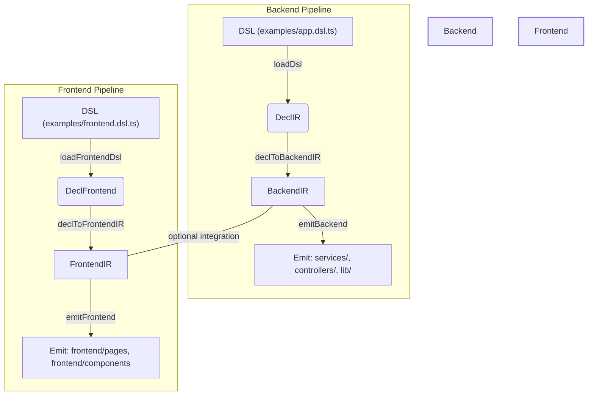

# Dokumentasi Arsitektur Tingkat Tinggi

## Diagram Alur Data Lengkap

## Daftar Kontrak Antarmuka Antara Komponen

### 1. DSL Runtime
- **Input**: DSL file (TypeScript)
- **Output**: DeclIR (Unified Declarative IR)
- **Kontrak**: 
  - Memuat dan mengevaluasi DSL
  - Mengumpulkan deklarasi ke dalam DeclIR
  - Validasi dasar (sintaks, struktur)

### 2. Decl Aggregator
- **Input**: DeclIR dari berbagai sumber (DSL, schema opsional)
- **Output**: DeclBundle
- **Kontrak**: 
  - Merging deklarasi dari berbagai sumber
  - Normalisasi nama (pluralisasi, id default)
  - Validasi dan normalisasi

### 3. Mapper Registry
- **Input**: DeclBundle
- **Output**: DomainIR (BackendIR, FrontendIR, CLIIR)
- **Kontrak**: 
  - Mendaftarkan mapper untuk domain tertentu (backend, frontend, cli)
  - Mengonversi DeclUnified ke DomainIR

### 4. Lowering Engine
- **Input**: DomainIR + Policies
- **Output**: TargetIR (ReactIR, NestIR, ElectronIR)
- **Kontrak**: 
  - Menerapkan policies dan konvensi ke DomainIR
  - Menghasilkan TargetIR yang siap untuk emitter
  - Validasi policies

### 5. Emitter Engine
- **Input**: TargetIR
- **Output**: Kode yang dihasilkan (TypeScript, HTML, dll.)
- **Kontrak**: 
  - Mendaftarkan emitter untuk target tertentu
  - Menghasilkan kode berdasarkan TargetIR
  - Format dan menulis file

### 6. CLI
- **Input**: Argumen CLI (--mode, --targets, optional --policies override; default policies bisa datang dari DSL/meta; optional --ext to load extensions)
- **Output**: Kode yang dihasilkan
- **Kontrak**: 
  - Menjalankan pipeline berdasarkan argumen
  - Memilih target dan emitter
  - Memproses policies

## Workflow Pembuatan Dokumentasi

1. **Analisis Komponen**: Identifikasi semua komponen utama dan alur data antara mereka.
2. **Pembuatan Diagram**: Buat diagram alur data menggunakan mermaid.js atau alat serupa.
3. **Dokumentasi Kontrak**: Daftarkan semua kontrak antarmuka antara komponen.
4. **Validasi**: Pastikan dokumentasi sesuai dengan kode aktual.
5. **Pembaruan**: Perbarui dokumentasi setiap kali ada perubahan arsitektur.
