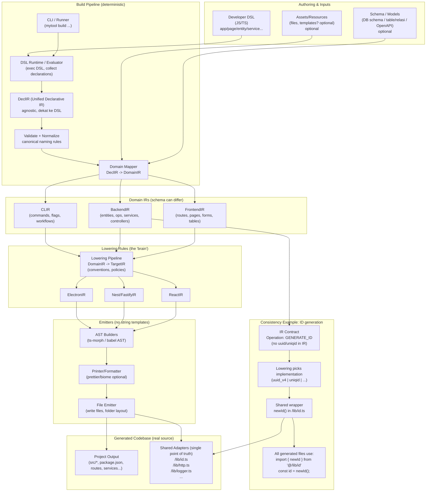

# Architecture Overview (Current Implementation)

> **irgen treats code generation as a compilation problem.**
>
> Instead of generating code directly from templates, irgen transforms your system description through explicit IR stages—policy, domain, target, and emit—making multi-target generation deterministic, auditable, and maintainable over time.

---

## 🧭 Overview (Philosophy)
irgen exists to move complexity from developers to a well-defined compilation pipeline. It allows developers to describe their system in terms of **domain and policy**, letting the toolchain handle the structural and repetitive implementation details across multiple platforms.

---

## 🧭 Overview (flow)

---

## Short explanation
- The pipeline separates *authoring* (developer DSL, optional schemas/assets) from *code generation* (emitters).
- A **Unified DeclIR** captures the declarations from any source in a canonical format.
- **Domain mappers** convert the DeclIR into domain-specific IRs (BackendIR, FrontendIR, CLIIR). Each DomainIR is tailored to what generators in that domain need.
- The **Lowering Pipeline** applies policies and conventions to the DomainIR to produce TargetIRs (e.g., ReactIR, NestIR) — this is where choices such as `GENERATE_ID` implementations are decided.
- Backend and frontend targets are independent: enabling one does not auto-enable the other, and each emitter writes its own package/tooling (backend stays backend-only; frontend ships React/router/Tailwind).
- **Emitters** use AST builders (no string templates), printers and file emitters to write the final project scaffolding and code.

**Implementation notes (current code)**
- Pipeline follows: Decl (DSL) ➜ bundle/normalize ➜ mapper ➜ DomainIR ➜ target lowering ➜ emitter. CLI always goes through mapper + lowering engine + emitter registry; `--emitter/--emitter-map` pick emitters per target.
- Decl: per-domain schemas in `src/ir/decl/*` (backend.raw, frontend, cli) + bundle/normalize for aggregated input.
- DomainIR: per-domain semantic contracts (`src/ir/domain/*`), free from DSL Zod schemas and policy decisions.
- TargetIR: emitter-facing contracts (`src/ir/target/*`); both backend and frontend targets now hold resolved policies after target-lowering.
- CLI target is scaffolded (Decl + mapper + target + `cli-fake` emitter producing `CLI.md`) and registered as a target.
- Backend policies resolved in target lowering (generateId/loggerImpl/httpClient/formatter/db); backend emitter consumes policies from TargetIR.
- **Frontend Policies & Theming**: Styling policies (primary colors, radius, fonts) flow into the React emitter. **Global Dark Mode** is implemented via a `themeToggle` property in components, resulting in a persistent state manager in `App.tsx` and adaptive Tailwind `dark:` variants across all templates.
- **Multi-page & Routing**: Lowering transforms multiple `page` declarations into a `react-router-dom` configuration. The emitter generates a global Navbar and Footer to wrap these routes.
- **Specialized Components**: New `marketing` sections and the **Syntax Highlighter** (`codeBlock`) use a policy-driven dependency tracker. The emitter detects these properties to conditionally inject third-party dependencies (like `react-syntax-highlighter`) into the generated `package.json`.
- Electron target: lowering resolves window/security/packaging/auto-update/reliability policies; emitter renders `main.ts`, `preload.ts`, `ipc-handlers.ts`, `package.json`, `tsconfig.json`, and helper scripts with security guards, session restore, logging, crashReporter slot, auto-update wiring (status events to renderer, retry-on-fail), and IPC whitelist enforcement. Checklist: see `docs/ELECTRON-CHECKLIST.md`.

---

## Implementation plan (phased)
This is a practical, incremental plan. Each phase lists goals, key tasks, and suggested acceptance criteria.

### Phase 0 — Discovery & Design (1–2 days) — **Done** ✅
- Write concise design notes and finalise terminology (DeclIR, DomainIR, TargetIR, Lowering, Emit pipeline). ✅
- Decide policy keys (e.g., GENERATE_ID, LOGGER_IMPL, HTTP_CLIENT). ✅
- Acceptance: design doc committed to `docs/DESIGN-PHASE-0.md`. ✅

### Phase 1 — Decl Aggregator & Validation (2–4 days) — **Done** ✅
- Implement **DeclUnified** schema and an aggregator that runs DSL loaders and optional schema readers. ✅
- Add central validation & normalization pass (pluralization, id defaults, operation normalization). ✅
- Acceptance: aggregator returns validated `DeclUnified` for sample DSLs (see `scripts/decl-validate.test.js`). ✅

### Phase 2 — Mapper Registry (2–3 days) — **Done** ✅
- Implement mapper registry (register mapper for `backend`, `frontend`, `cli`). ✅
- Port `declToBackendIR` and `declToFrontendIR` to consume `DeclUnified` (via mappers). ✅
- Acceptance: produce BackendIR & FrontendIR from same DeclUnified source (see `scripts/mappers.test.js`). ✅

### Phase 3 — Lowering Engine & Policies (3–7 days) — **Done** ✅
- Create Lowering engine to convert DomainIR → TargetIR(s) with policy injection (POC: `declToBackendIR(app, policies?)`). ✅
- Extract policy contracts (e.g., ID policy) from lowering steps and expose `policies.generateId` and resolved `idProvider`. ✅
- Acceptance: Lowering yields IR with policy decisions and emitters honor policies (see `scripts/policy.test.js`). ✅
- Follow-up: Added a lightweight Lowering engine facade and registered backend lowering with it; added `scripts/lowering.test.js` to exercise transform registration and policy validation. ✅
- Policy validation: added zod-based policy schema support in the engine and switched backend to register a `generateId` schema; tests added (`scripts/policy-zod.test.js`). ✅

### Phase 4 — Emitter Pipeline (3–5 days) — **Done** ✅
- Implemented a small Emitter Engine (`src/emit/engine.ts`) allowing emitters to register and be invoked by name.
- Reworked emitters to register with the engine and support AST-based emission (`src/emit/backend-tsmorph.ts`, `src/emit/frontend-react.ts`).
- Added CLI discovery and invocation flags (`--emitters`, `--emitter=<name>`) and improved argument parsing (`src/cli.ts`).
- Added smoke tests: `scripts/emitter.test.js` (engine run) and `scripts/emitter-cli.test.js` (CLI list/run). All tests pass in CI/local runs.
- Acceptance: generator outputs remain functionally equivalent for sample runs; emitter engine and CLI smoke tests pass.

**Notes / follow-ups:**
- Remaining polish items (not required for Phase 4 acceptance): add a formatting/printer step (Prettier/Biome) before saving files, and add golden tests to assert emitted artifacts. These are tracked as follow-ups and fit into Phase 7 (Tests & Golden Files).

### Phase 5 — Shared Adapters & Library (2–4 days) — **Done** ✅
- Implemented `/lib/*` adapters generation: `lib/id.ts`, `lib/logger.ts`, and `lib/http.ts` via the backend emitter.
- Wired policies (`loggerImpl`, `httpClient`) into the lowering step and registered zod validation for them.
- Added `scripts/adapters.test.js` to validate adapter generation and contents; test passes locally.
- Acceptance: generated projects import and use `@/lib` stubs and the lowering + emitter flows honor policy choices.

### Phase 6 — CLI Orchestration & Flags (1–2 days) — **Done** ✅
- Added `--targets=backend,frontend` to orchestrate the pipeline from DSL to emitted outputs (generates target subfolders under the chosen `outDir`).
- Added `--inspect-ir` to print the lowered TargetIR for debugging and optional `--policies='{"key":"val"}'` to override policies (default policies sekarang bisa disuplai dari DSL/meta).
- Added `--ext=path/to/ext.ts` to load extension modules that can register mappers/emitters/target mappings (same shape as programmatic extensions).
- Acceptance: CLI runs orchestration for requested targets; `scripts/cli-build.test.js` exercises and validates the behavior. ✅

### Phase 7 — Tests & Golden Files (3–7 days) — **Done** ✅
- Added golden test suite (`scripts/golden-test.js`) that verifies emitted artifacts (models, services, controllers, adapters, package.json) against `test/golden/*` fixtures.
- Added `scripts/update-golden.js` and `npm run update-golden` to regenerate and commit golden fixtures.
- Implemented optional formatting step in the backend emitter (uses `ir.policies.formatter`, default `prettier`) and added `prettier` as a dev dependency to make formatting available in CI.
- Acceptance: CI/test runner can run `npm run test:golden` and will fail on mismatches. Run `npm run update-golden` to refresh fixtures when intentional changes are made.

### Phase 8 — Examples & Docs (1–3 days) — **Done** ✅
- Added `examples/frontend.dsl.ts` (frontend DSL) and `examples/app.dsl.ts` demonstrates combined backend+frontend generation.
- Added `examples/README.md` and `docs/PHASE-8.md` with usage and acceptance criteria.
- Added `scripts/gen-frontend.test.js` (CIable test) and `npm run test:gen-frontend` to validate frontend generation.
- Acceptance: `npm run gen:frontend` and `npm run gen:combined` work and `npm run test:gen-frontend` passes locally.

---

## Estimates & Notes
- Total rough estimate for a faithful implementation: **2–4 weeks** for a robust, tested pipeline (depending on team size and depth of emitter rework).
- The migration can be iterative: start with DeclUnified + mapper registry (POC), then progressively rewire lowering and emitters.
- Early tests and golden files are critical to keep regressions manageable.

---

## Acceptance Criteria (explicit)
- Single CLI run can consume DSL and produce one or more DomainIRs and TargetIRs.
- Policies such as ID generation are decided in lowering and implemented via shared adapters (no concrete implementation embedded in IR).
- Emitters use AST builders and produce normalized, formatted code that passes linting.
- Golden tests are available for core examples and CI enforces them.

---

## Migration strategy (high level)
1. Implement **POC**: DeclUnified + mapper registry → run backend generation via new flow (keeps emitters untouched temporarily).
2. Implement Lowering engine and policy contracts; migrate backend lowering into engine.
3. Swap emitters to emit via AST pipeline and add printers.
4. Expand tests and examples.

---

## Risks
- Scope can grow quickly; mitigate with strict PO/phase gate reviews.
- Golden tests can be brittle; provide `update-golden` workflow.
- Must freeze common AST formatting early to avoid churn.

---

## Next steps (recommended immediate action)
1. Create the POC for DeclUnified + mapper registry (2–3 days). ✅
2. Add minimal golden tests for POC.
3. Review policy key list and agree on initial adapters (id, logger, http).

---

## POC scaffold (what I added)
I scaffolded a small POC to demonstrate the unified flow end-to-end (minimal, iterative):

- `src/ir/decl/bundle.ts` — `DeclBundle` type and helper
- `src/dsl/aggregator.ts` — aggregator that loads DSLs, bundles, then normalizes declarations
- `src/mappers/index.ts` — simple mapper registry and builtin registration for `backend` and `frontend`
- `scripts/poc-smoke.js` — a minimal smoke test that runs `npm run gen:combined` and checks `generated/lib/models.ts` and `generated/services`
- `package.json` scripts added: `gen:combined` and `test:poc`

How to run the POC:

- `npm run gen:combined` — generates backend (and attempts frontend) from `examples/*` DSLs into `generated/`
- `npm run test:poc` — runs the smoke test and reports success or failure

Notes:
- The frontend loader may fail on some systems during this POC due to runtime module resolution; the POC aggregator is resilient and will proceed with backend generation even if frontend DSL fails to load.
- This is intentionally minimal — next step is to harden the frontend loader and add golden tests and CI integration.
