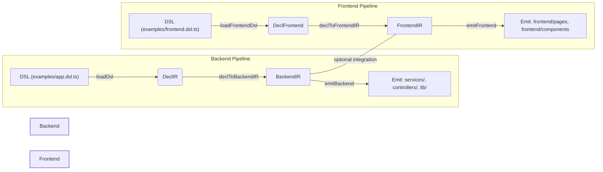

# Architecture Overview (Current Implementation)

Ringkasan arsitektur proyek *ir-codegen* — tujuan, alur transformasi (DSL → DeclIR → Lowering → Domain IR → Emitter), komponen utama, dan panduan singkat untuk memperluas atau menjalankan pipeline (backend & frontend dipisahkan).

---

## 🔎 Tujuan singkat
Proyek ini adalah generator kode minimal yang memungkinkan developer menulis DSL (TypeScript) untuk mendeskripsikan aplikasi (backend dan/atau frontend), lalu menjalankan pipeline yang menghasilkan kode TypeScript nyata (services, controllers, models, komponen React). Arsitektur dirancang agar komponen-komponen (DSL, IR, lowering, emitter) terpisah dan dapat dikembangkan secara independen.

---

## 🧭 Overview (flow)



Ringkasan: backend dan frontend memiliki pipeline yang terpisah — masing-masing DSL → Decl → Lowering → Emit. Mereka dapat dijalankan terpisah atau dikaitkan secara manual bila diperlukan.

---

## 📁 Struktur & Peran Berkas Utama

| Path | Peran | Keterangan |
|---|---|---|
| `src/dsl/runtime.ts` | Backend DSL runtime | helper `app(...)`, `entity(...)`, `model(...)`, `create/get/list/update/remove/op(...)` |
| `src/dsl/frontend-runtime.ts` | Frontend DSL runtime | helper `frontend(...)`, `page(...)`, `component(...)` |
| `src/ir/decl.ts` | Decl IR (DSL-facing) | Zod schema + types untuk DSL backend |
| `src/ir/backend.ts` | Backend IR (domain) | BackendIR types untuk lowering & emitter |
| `src/ir/frontend.ts` | Frontend IR (domain) | FrontendIR types untuk pages/components |
| `src/lowering/backend.ts` | Backend lowering | Map `DeclApp` → `BackendIR` (naming rules, pluralization) |
| `src/lowering/frontend.ts` | Frontend lowering | Map `DeclFrontendApp` → `FrontendIR` |
| `src/emit/backend-tsmorph.ts` | Backend emitter | Generates `generated/lib/`, `generated/services/`, `generated/controllers/` using ts-morph |
| `src/emit/frontend-react.ts` | Frontend emitter | Generates `generated/frontend/pages/`, `generated/frontend/components/` (React TSX) |
| `examples/app.dsl.ts` | Backend example | Demo DSL untuk backend |
| `examples/frontend.dsl.ts` | Frontend example | Demo DSL for frontend |
| `src/utils/string.ts` | Shared utils | `pascal`, `camel`, `kebab`, `pluralize` |
| `src/cli.ts` | Entrypoint | Runs either backend or frontend pipeline (`--mode=`) |

---

## ⚙️ How to run

- Generate backend (default):

```bash
npm run gen            # uses examples/app.dsl.ts
```

- Generate frontend only:

```bash
npm run gen:frontend   # uses examples/frontend.dsl.ts
```

- CLI supports `--mode=frontend` or `--mode=backend` and you can pass DSL path and out directory as args.

---

## ✍️ DSL examples (short)

Backend DSL (examples/app.dsl.ts):

```ts
import { app } from "../src/dsl/runtime.js";

app("DemoApp", (a) => {
  a.meta("owner", "Bli Agus");
  a.meta("frontend", { react: true, tailwind: true });

  a.entity("Product", (e) => {
    e.model({ id: "string", name: "string", price: "number" });
    e.create(); e.get(); e.update(); e.remove(); e.list();
  });
});
```

Frontend DSL (examples/frontend.dsl.ts):

```ts
import { frontend } from "../src/dsl/frontend-runtime.js";

frontend("DemoFrontend", (f) => {
  f.component("ProductList", (c) => { c.entityRef = "Product"; });
  f.page("Products", { path: "/products" }, (p) => { p.component("ProductList"); });
});
```

---

## 🧩 Emitted artifacts (examples)

- Backend
  - `generated/lib/models.ts` — Model interfaces
  - `generated/services/<entity>.service.ts` — In-memory service implementations
  - `generated/controllers/<entity>.controller.ts` — Thin controller wrappers
- Frontend
  - `generated/frontend/pages/*.tsx`
  - `generated/frontend/components/*.tsx`
  - `generated/frontend/index.tsx`

---

## ✅ Design decisions & rationale

- Separation of concerns: backend and frontend pipelines are independent to allow maintainers to iterate on one area without coupling.
- DSL-first: A small, expressive DSL enables compact domain descriptions and deterministic generation.
- Use ts-morph for emitter: generates type-safe TypeScript ASTs and writes formatted files.
- Keep emitted runtime minimal: generated services are intentionally simple (in-memory) for starters and easy to replace with adapters later.

---

## 🚀 Extensibility & Next steps

Suggested improvements that fit the architecture:

- Add plugin hooks for emitters (e.g., adapter to swap in DB-backed service instead of in-memory).
- Add Zod validation generation for models to validate create/update payloads.
- Generate HTTP clients and React hooks for the frontend pipeline for real networked usage.
- Add unit tests for the generator and golden-file tests for emitted outputs.
- Add CLI flags to choose which emitters to run and output paths per emitter.

---

## 📌 References (in repo)
- `src/dsl/` — DSL runtimes
- `src/ir/` — IR definitions and schemas
- `src/lowering/` — lowering rules
- `src/emit/` — emitters (backend & frontend)
- `examples/` — sample DSL files to try

